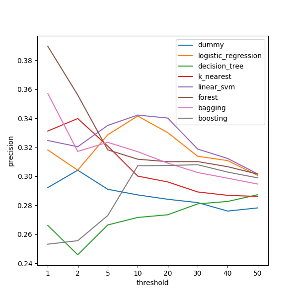
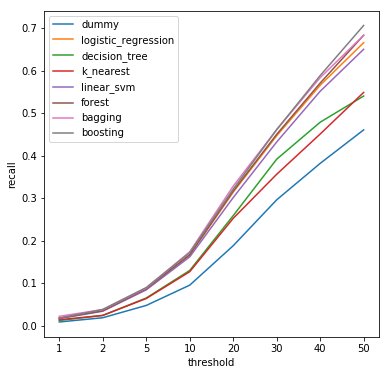
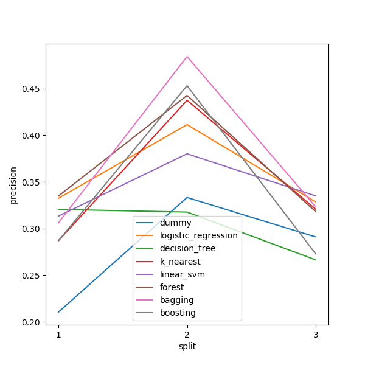

# Picking Projects on DonorsChoose.org: Recommendation
## Goal
The website DonorsChoose.org wants to help projects find funding. It has a
landing page that users of the site see every time they go to the site. The
product team would like to feature projects on the landing page that otherwise
might not get funded.

Ideally, we would like to develop a machine learning algorithm that can predict
which projects will not get funded within 60 days. The product team can then
feature only projects from this predicted set on the landing page.

The product team only has room on the landing page to feature 5% of all
projects on DonorsChoose.org. This is our available intervention.

## Metric Choice
Since more than 5% of projects do not get funded within 60 days, then the
metric that is probably most important here is precision. We cannot hope to
feature all projects that need to be featured, so instead we want to focus on
making sure that the projects we feature do in fact need help.

The best we could do would be to make sure that every project we feature would
not otherwise have been funded. That would mean a precision of 100%; in this
world we would reduce the number of projects being unfunded by as much as we
possibly can.

## Model Evaluation
Having trained lots of models on our input data, we need to carefully consider
which model will be the best model according to our target metric.

If you examine Figure 1, you will see that at the 5% threshold the model with
the best precision is the random forest classifier (followed very quickly by
the linear SVM classifier). At this threshold, both models are able to predict
with roughly 34% precision.

This does not sound like a particularly impressive figure, because it means
that more often than not we are making the wrong prediction and feature a
project that would have been funded anyway. But this model performs
better than picking randomly, which would yield a project in need
of funding only 29% of the time.

The precision might be higher if we lowered our threshold slightly, but this
would mean that we are reaching fewer projects in need of funding. Figure 2
shows how recall falls as we lower the threshold.

## Performance Over Time
The last figure, Figure 3, shows how the precision of several models varies
over time. This graph is showing precision at the 5% threshold.

What this graph tells us is that precision will vary going forward. Just
because we saw precision of 34% when the model was used on our test set does
not mean we will keep seeing that value going forward. In fact, the model did
better on the second time split than on the final test set, showing exactly how
precision could fall (though also rise) for new data.

## Policy Recommendation
Based on this analysis, we should employ the **random forest** model with
$n_trees = 500$ in production because it does best at the 5% threshold. Though
the overall performance is not very impressive, the model is still better than
randomly picking projects to feature.

The model will give the web administrators for DonorsChoose.org the opportunity
to feature 5% of all projects on their landing page so that those projects get
more visibility. By using the model, the administrators can be confident that
they are doing a better job of featuring projects that might otherwise not get
funded than if the administrators picked projects randomly.

Going forward, the site administrators should continue to train the random
forest model using new data so that its performance can improve. This should
help smooth out the inconsistency in performance that is apparent in Figure 3.

